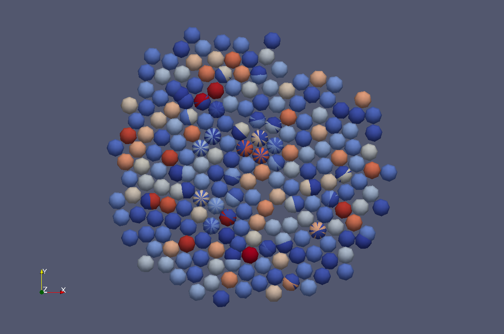

# Rustic Cells
(c) 2013 Olivier Saut osaut@airpost.net

## What is Rustic Cells?
A simple discrete model for cellular proliferation and migration whose main purpose is to help me learn [rust](https://github.com/mozilla/rust) and experiment concurrency.

Requires a recent incoming build of [rust](https://github.com/mozilla/rust).

## Using RC
A simulation can be run with

	make run

It should produce several vtk files that can be read with [Paraview](http://paraview.org) producing images like this .

